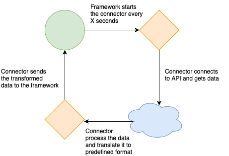

## **Intro**

This exercise is comprised of 2 steps.

To complete it, you are provided with some resource files:

General Notes:

-   All 3rd party API Calls are via their respective official Rest API

-   All Config\\Files files stored in JSON format

## **Step 1 - Create a Connector**

A Connector is a script with some input parameters, that is being run
periodically and scheduled by some management framework.

The connectors goal is to connect to some 3rd party product, fetch and process
data from it using its API, and deliver that data back to the framework (in the
data format that the framework expects).

In this exercise, the communication with the framework will done via the
SubProcessInputOutputHandler class.

-   Use SubProcessInputOutputHandler.connector_params at the start of the script
    to get the connector inputed parameters.

-   Use SubProcessInputOutputHandler.end at the end of the script to return the
    output to the framework.

The framework runs the connector periodically every X seconds (ie: every 10
seconds).

In each iteration, the connector’s main method is called.

You case use the **VirusTotalConnector.py** stub from the Resources folder

### **Connector - Virus Total**

The objective of this connector is, in each iteration, read a list of entities
(domains) from a file, and for each entity scan it using the
<https://www.virustotal.com/>[**VirusTotal**](https://developers.virustotal.com/v3.0/reference#overview)
API, and return data about suspicious entities, as part of the ConnectorResult
output.

-   Source Files:

    -   All sources files are stored in a single folder, its path is given as a
        parameter to the connector

    -   In each iteration, the connector should process a single file from the
        source folder

    -   Each file will contain a list of entities (domains - ie:
        <http://msn.com>[msn.com](http://msn.com))

    -   Choose any format you want for the files (ie: json, CSV, free text)

    -   At the end of each iteration, add “.done” suffix to the file name to
        mark it as done

    -   From each file, read only a limited number of entities, the limit should
        be provided via a paremeter

-   For each hostname, query the VirusTotal API and return result as part of the
    ConnectorResult

    -   Result format is a dictionary of string:any, when the key is the entity
        (hostname) and the value is:

        -   if an entity is suspicious (define suspiciousness based on
            “reputation” field) : return it with relevant data (of your
            choosing)

        -   If an entity is not suspicious: return it with “Not Suspicious”

-   For this step, you can implement the SubProcessInputOutputHandler to
    input\\output from hardcoded files, and just run the
    *VirusTotalConncetor.py* manually **OR** implement step 1 + 2 together.

## **Step 2 - Write a Connector Service Framework**

### **Cycle Service:**

The Cycle service is a service with an infinite loop, that runs python
subprocess of connector scripts at configured intervals. The connectors generate
data, and the Cycle service saves it to an output folder.

The framework is designed to accommodate different types of connector (each with
its own code), and run several instances of them with separate configuration.

For this part, we will test the Cycle service with 2 instances of the same type
of connector we implemented in step 1, each with it’s own source folder, and
output_folder.

-   Connector settings config file:

    -   This file location can be hardcoded, it can contain the settings of all
        the connectors

    -   Each connector has it’s own parameters configurations

    -   Interval is defined for each connector

        -   Interval determines how much time should pass between the moment the
            connector has finished, until the moment it will start again.

-   *Connector (Sub Process) Input/Output:*

    -   **Input**: Pass the parameters of the connector from the settings, to
        the sub-process via the **stdin channel** (not as process args) (you can
        come up with any protocol you want for this)

    -   **Output**: Pass the connector output from the sub-process to the
        service as an AlertsPackage object via the **stdout channel**

-   Service Output Folder:

    -   After each iteration, save the connector output to a new timestamped
        file

    -   This folder path can be hardcoded

For this exercise, the “service” can be a manually executed python program.

It’s important to implement the loop yourself (and not use a Scheduler for
example)

**Notice** - the Cycle service shouldn’t fail if the connector script has
failed. However it should report if the connector completed successfully or not.

### **SubProcessInputOutputHandler:**

A class that wraps the input\\output communication with the host-process.

A stub is available in the resources folder. Please adjust it to run as part of
the Cycle service.

The class should expose the following:

-   **Property** *connector_params -* parsed out parameters from current process
    stdin input

-   **end(alerts_package)** method

    -   Will receive an ConnectorResult object, will return it via the stdout

    -   Will end the current process
